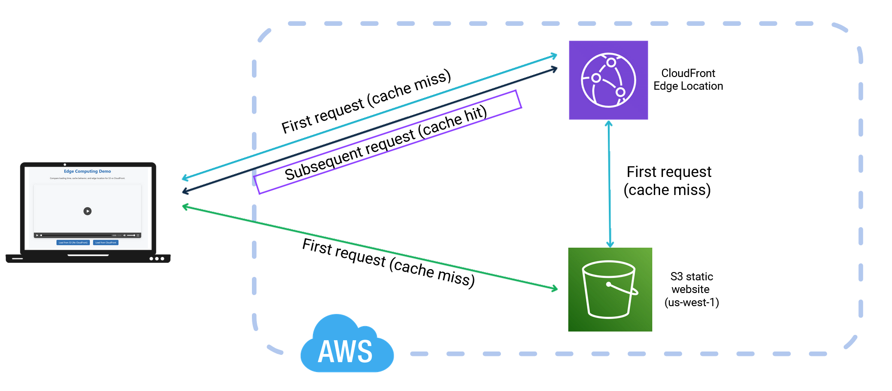
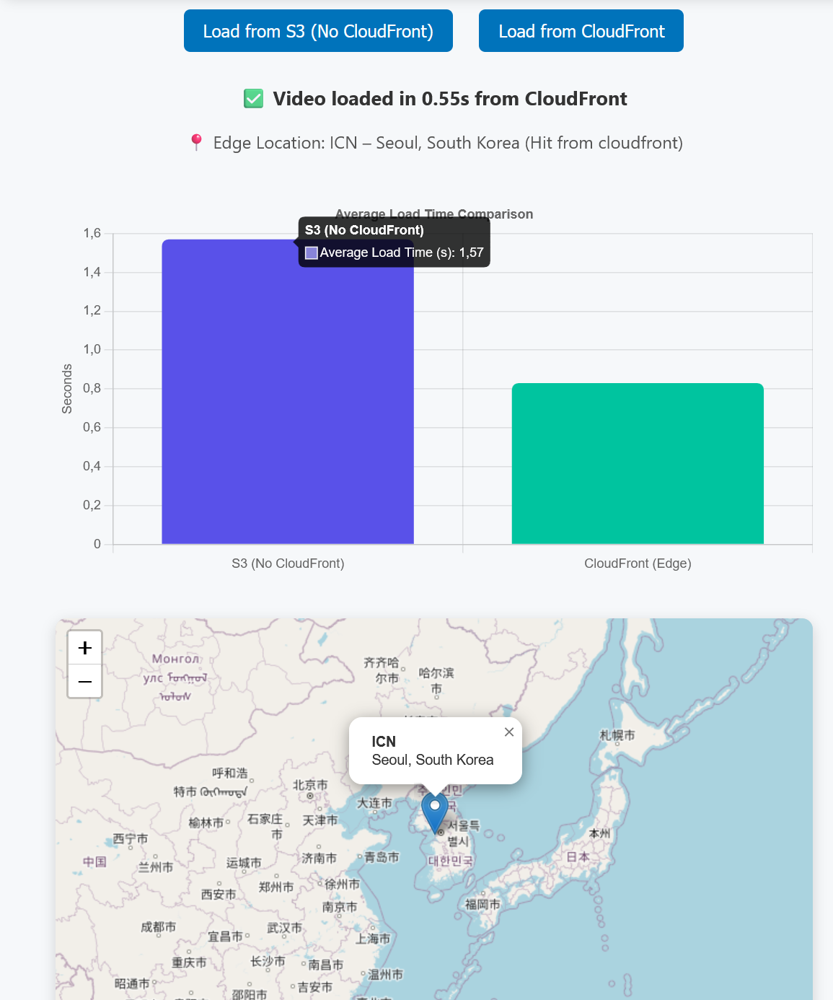

# 🌐 Group 01 — Cloud Computing Demo

## 🚀 Overview
This project demonstrates the performance difference between serving static content directly from an **Amazon S3** origin versus through **Amazon CloudFront** (AWS’s Content Delivery Network).

A simple HTML page loads a video file from both sources and measures:
- Response time (load latency)
- Edge location (via `x-amz-cf-pop` header)
- Cache behavior (first request vs. subsequent cached requests)

---

## 🧱 Architecture of the Demo

The setup consists of:
- **S3 Bucket** (Region: `us-west-1`)  
  - Hosts the static website (`index.html`) and the video file.  
  - Metadata configured with `Cache-Control: no-cache, no-store, must-revalidate` to avoid browser caching.
- **CloudFront Distribution**  
  - Uses the S3 website endpoint as the origin.  
  - Caching and CORS enabled in the response headers policy.  
  - Edge locations automatically serve cached copies of the video.

<p align="center">
  
</p>

---

## 🧩 Demo HTML Structure
The HTML file contains three main sections:
1. **Interface:**  
   Two buttons allow the user to load the same video either from **S3** or **CloudFront**.

2. **Performance Measurement:**  
   JavaScript measures load times using `performance.now()` and displays average latency.

3. **Visualization:**  
   - A bar chart (Chart.js) shows average load time comparison.  
   - A map (Leaflet.js) displays the edge location serving the CloudFront request.

<p align="center">
  
</p>

---

## ⚙️ How to Reproduce
1. Upload your video and `index.html` to an S3 bucket.
2. Enable **Static Website Hosting** for the bucket.
3. Set bucket and objects as public or configure ACL
4. Create a **CloudFront distribution** using the S3 website endpoint as origin.
5. Update your `index.html` URLs:
   ```js
   const s3URL = "http://your-bucket.s3-website-us-west-1.amazonaws.com/video.mp4";
   const cfURL = "https://your-distribution.cloudfront.net/video.mp4";
6. Open the page in a browser and compare:
   - **S3**: High latency (direct from origin)  
   - **CloudFront**: Lower latency after caching (served from edge)

---

## 📊 Results Example

| Source        | Avg. Load Time (s) | Cache Status | Edge Location |
|----------------|--------------------|---------------|----------------|
| S3 (Origin)    | 2.8                | Always Miss   | us-west-1      |
| CloudFront     | 1.1 → 0.4          | Hit after 1st | HEL51 (Helsinki) |

---

## 🧠 Key Takeaways
- CloudFront significantly improves latency by serving content from nearby **edge locations**.
- S3 origin always fetches directly from the regional server.
- With browser caching disabled, the true CDN benefit becomes evident.

---

## 👥 Contributors
**Group 01 – EDISS Cloud Computing Course**  
- Adiel Luna
- Manuel Padilla
- Rajshree Rai
- Tariq Aziz
- Zeynal Mardanli

---

## 📂 Repository Structure

├── index.html # Demo interface
├── demo-architecture.png
├── demo-ui.png
└── README.md

This project is for educational purposes.


